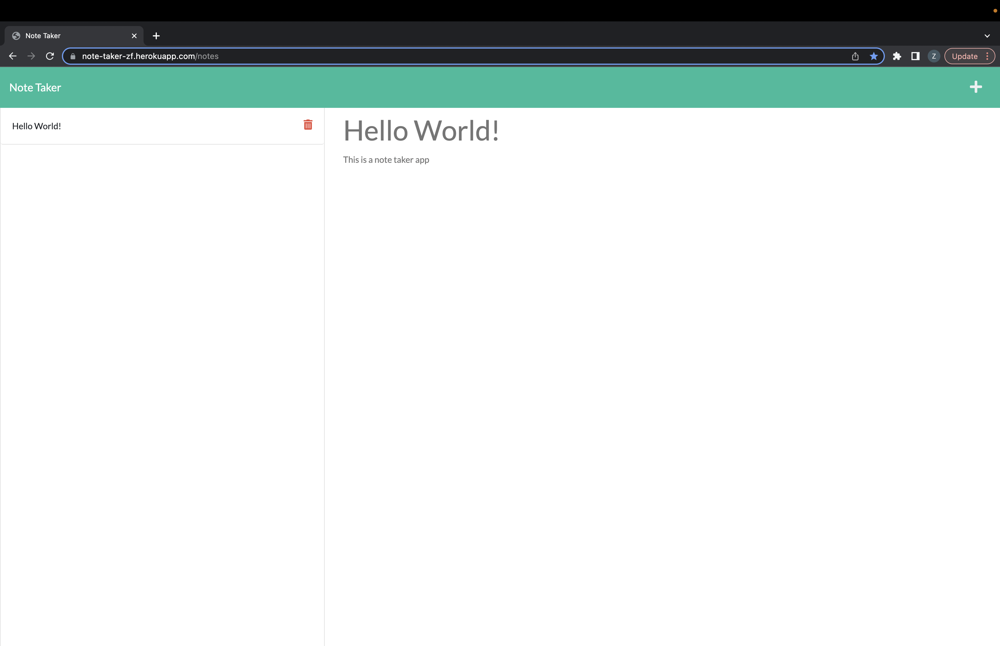

# Note Taker

In this challenge, I created an app that allowed a business owner to write and save notes in order to organize tasks that need completed.

The landing page contains a link to the note taker app.
Added functionality that allows the user to click the link to the note page, ane be presented with a page of existing notes in the right hand column and empty fields to enter a new note title and text in the right-hand column.
After entering a new note title and text, a save icon will appear in the navagation at the top right of the page.
Created function so that the new note entered is saved and appears in the left-hand column with the other existing notes.
Added function to select saved notes on the left-hand column to appear in the right-hand column.
Created function that allows clicking the write icon on the top navigation, an empty field will appear in the right-hand column
Added function that when User selects the trash icon on the left column of the page, the saved note in the left-hand column will be deleted

https://note-taker-zf.herokuapp.com/

